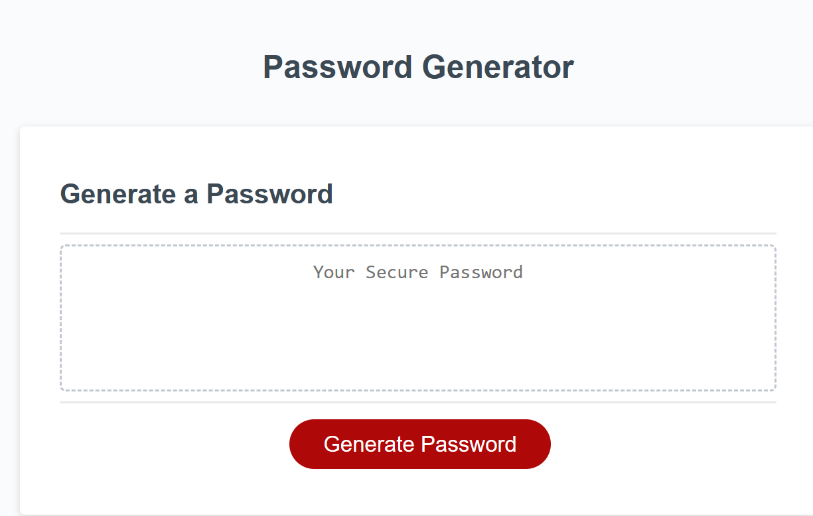
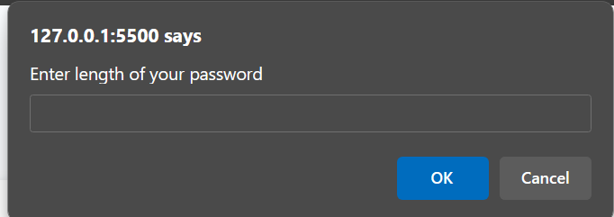
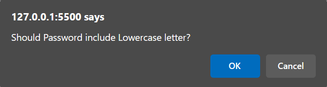
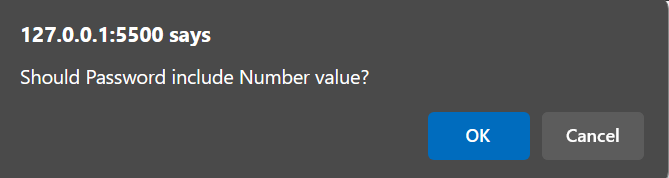
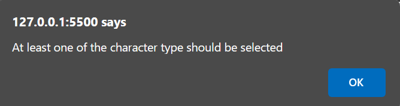
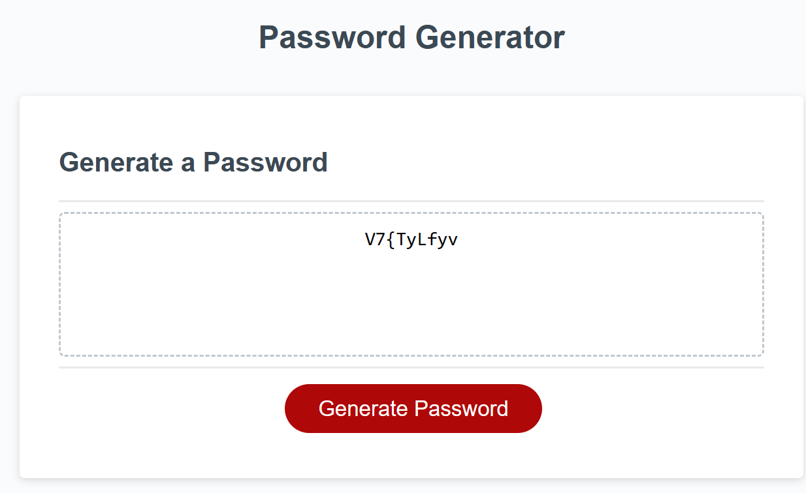

# Application : Password_Generator

## Motivation

- To develop random password generator that meets user criteria

## Table of Contents

1. [About the Project](#about-the-project)
2. [Screenshots](#screenshots)
3. [URL](#url)
4. [Author](#author)

# About the Project

- The application is developed using Web API's, Javascript methods, logical and conditional statements.
- Application prompts user for password criteria.
- Password criteria includes choosing appropriate length for the password and selecting atleast one character type.
- Random password generator is called until a password is generated that meets the selected criteria.

# Screenshots

**[Back to top](#table-of-contents)**

# URL

https://sangeethagnanavel.github.io/Password_Generator/

# Author

Sangeetha Gnanavel, a Full Stack Developer having enormous experience in Front-end and Back-end application development.

**[Back to top](#table-of-contents)**
